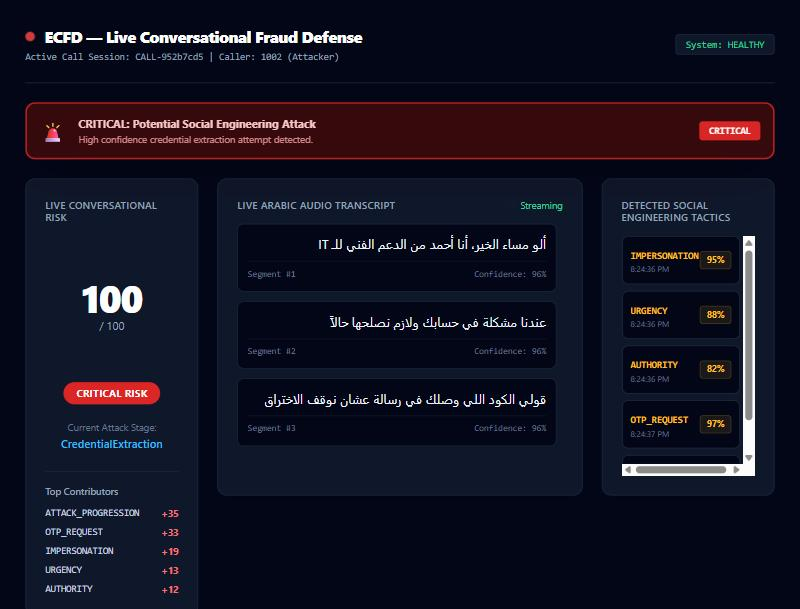

# ECFD — Full Project Audit & Forward Plan

**Date:** 3 October 2026 · **Scope:** entire repository (code, configs, CI, docs, proposals, untracked files) · **Audited commit:** `d6ad197` + working tree

---

## 1. Bottom line

ECFD has an excellent **paper foundation**: clear scope, sound architecture (ADR-0001 External Media is the right call), a sensible vertical-slice build plan, and a well-reasoned tech-stack study. The **code is scaffolding** — roughly 9,000 lines were committed, of which ~1,600 are code (C#, TypeScript, Python), and none of it touches a real phone call yet.

The audit found three things that matter most:

1. **The demo pipeline was broken in two independent ways** (dashboard received zero events; the OTP step never registered). **Both fixed and now covered by an end-to-end test.**
2. **The Simple Proposal contains fabricated or unverifiable citations.** This is an academic-integrity risk that must be fixed before the document goes anywhere (or corrected if it already has).
3. **The schedule has quietly slipped:** by the build plan, the VoIP lab (Phase 1, weeks 2–4) should be done now. No real call has been placed — Docker isn't even installed on this machine, and the dialplan could not have connected a call.

### Verification performed

| Check | Before | After |
|---|---|---|
| `dotnet build` | ✅ 0 warnings | ✅ 0 warnings |
| `dotnet test` | ✅ 5/5 (engines only) | ✅ **22/22**, incl. full API + SignalR end-to-end test |
| Demo attack script via API | ❌ stuck at `Pressure`, risk 59 (Medium) | ✅ `CredentialExtraction`, **Critical** |
| Dashboard live events | ❌ **0 received** | ✅ all 7 event types stream; screenshot below |
| Frontend `npm run build` | ❌ impossible — no app entry point | ✅ builds and type-checks |
| GitHub Actions (last run 15 Aug) | ✅ green (backend, ML, secret scan) | — |

---

## 2. Findings

Severity: **Critical** = breaks the demo or the project's credibility · **High** = will block a milestone · **Medium** = correctness/design debt · **Low** = hygiene.

### Critical

| # | Finding | Evidence | Status |
|---|---|---|---|
| C1 | **Dashboard never received any event.** `SignalRNotifier` injected `IHubContext<Hub>`, which has its own empty connection registry, separate from `DashboardHub`. Every `SendAsync` went nowhere. Infrastructure also referenced `Microsoft.AspNetCore.SignalR.Core 1.1.0` (an ASP.NET Core 2.x-era package). | Live SignalR client: 0 events received. | **Fixed.** Hub moved to Infrastructure, notifier uses `IHubContext<DashboardHub>`, framework reference instead of 1.1.0 package. Regression test fails if reverted (verified). |
| C2 | **Every two-word tactic was silently dropped.** ML services emit `OTP_REQUEST`; `Enum.TryParse` cannot map it to `OtpRequest`. So `OTP_REQUEST`, `CREDENTIAL_REQUEST`, `PAYMENT_REQUEST`, `REMOTE_ACCESS`, `VERIFICATION_BYPASS`, `SENSITIVE_ACTION` never reached the FSM. The headline demo could not reach Critical. | Script: OTP utterance → stage stayed `Pressure`, risk 59. | **Fixed.** `EvidenceTypeLabels` maps wire labels ↔ enum; unknown labels are now logged, not swallowed. 15 tests. |
| C3 | **Fabricated / unverifiable related work in `ECFD_Simple_Proposal` (.md/.docx/.pdf).** Six of eight surveyed systems (VigilantPhone/CCS, VERN/S&P, FraudShield/USENIX, SocialSense/ASIACCS, VoiceGuard/ICC, ArSEFD/EJIS) could not be found; web searches return nothing matching. Real works are mis-dated to 2026 (AASIST is ICASSP **2022**; ASVspoof 2021 is **2021**; MGB-3 is ASRU **2017**; Common Voice is LREC **2020**). "FRA Circular No. 2026-CS-17" and the MCIT report also look invented. Also factually wrong: "ASVspoof 2021 **PA**" is the *physical-access/replay* track, not the telephony one — codec/channel conditions are in **LA** (and DF). | Searches in §6. | **Open — your action.** See §4.1. |
| C4 | **Claims written in the past tense about work not done.** The Simple Proposal states recordings were "conducted with fully informed written consent" (the dataset doesn't exist). The Backend Lead spec says "I implemented… I built", "broadcast latency is < 100 ms" (it was delivering nothing). Examiners compare documents against the repo. | — | **Open — your action.** Rephrase as plans ("will", "targets"). |

### High

| # | Finding | Status |
|---|---|---|
| H1 | **Risk score inflated on repetition.** Every utterance's evidence was summed with no deduplication or decay. Saying "أنا من البنك" four times → **Critical alert**; a benign "there's a printer problem, we need to fix it" ×3 → **High**. | **Fixed.** Each tactic counts once per call at its strongest confidence; tests added. Critical alert now fires once per call, not on every subsequent utterance. |
| H2 | **The VoIP lab could never connect a call.** Dialplan answered every call and sent it into `Stasis(ecfd-stasis)`; with no ARI app connected, Asterisk hangs up. 1002 → 1001 (Phase 1 DoD) was impossible. Also: no `direct_media=no` (RTP would bypass Asterisk, so nothing to tap), no NAT options for Docker, RTP range 10000–20000 vs. only 10000–10100 published, and the Media Gateway was planned on port 10000 — **inside** Asterisk's RTP range. | **Fixed in config** (untested — no Docker here): plain `Dial()` for Phase 1, PJSIP media/NAT options, RTP range aligned to 10000–10100, gateway moved to 40000. |
| H3 | **Frontend could not run.** Components existed but no `app/` entry, layout, Tailwind/PostCSS config; `Dashboard` lacked `"use client"`. Next 14.2.5 has published security advisories. | **Fixed.** Minimal app shell, Next → 14.2.35. Verified in browser. |
| H4 | **.NET 8 support ends 10 Nov 2026** — five weeks from now — and the project runs until mid-2027. (.NET 9 ends the same day.) **Python 3.10** (all ML Dockerfiles/CI) reaches end-of-life this month. | **Open.** Move to .NET 10 LTS (supported to Nov 2028) and Python 3.12 — see plan. |
| H5 | **Repository is public** while the LICENSE says "All Rights Reserved / proprietary" and the IP guide discusses spin-out protection. Untracked proposals and the sponsorship brief would become public if committed. | **Open — your decision.** |
| H6 | **No named team.** Every doc still says "Member 2…6"; the proposal has `[Team Member 2]` placeholders. A plan that allocates 75% of the work to five unnamed people is the single largest schedule risk. | **Open — your action.** |
| H7 | **ASR service faked "real" output.** With `ML_USE_MOCK_MODE=false` it returned a hard-coded sentence labelled with the real model name — a trap for any WER/latency evaluation. | **Fixed.** Returns HTTP 501 until inference exists. |

### Medium

| # | Finding | Status |
|---|---|---|
| M1 | **Risk formula in docs ≠ code.** README/ADR-0002 promise `0.45·content + 0.30·progression + 0.15·voice + 0.10·context`; code adds raw points and caps at 100 (the live demo saturates at 100). The README's own example doesn't add up (35+20+15+35 = 105, shown as 91). `RiskSnapshot` component fields are never filled. | Open — design decision (§4.3). |
| M2 | **No speaker attribution.** Tactics spoken by the *employee* ("I won't give you the code") count exactly like the caller's. ECFD should score the caller leg; per-direction audio is available via ARI snoop (`spy=in`/`out`). | Open — design. |
| M3 | **FSM gaps.** A caller who skips the pleasantries ("read me the code you just got") never leaves `Normal`. `SensitiveAction` doesn't accept `PAYMENT_REQUEST`. Several tactics in one utterance can jump two stages at once (order-dependent). No de-escalation. | Open — design with dataset. |
| M4 | **NLP keyword rules too loose.** `"it"` matched inside any word ("with", "submit") as IMPERSONATION; `"أنا من"`, `"مشكلة"`, `"لازم"`, `"فلوس"` fire on ordinary speech. | `"it"` fixed (case-sensitive whole-word `IT`; Latin keywords whole-word). Arabic rules remain for the NLP owner — they are the baseline, so measure their FPR rather than hide it. |
| M5 | **Event envelope not implemented.** Spec requires `eventType` (versioned, e.g. `risk.updated.v1`), `eventId`, `timestamp`, `sessionId`, `payload`. Code sends bare objects with unversioned names. Stage names also differ between spec (`CREDENTIAL_EXTRACTION`) and code (`CredentialExtraction`). | Open — do before the frontend grows. |
| M6 | **Persistence is fake.** `UseInMemoryDatabase` is hard-coded; PostgreSQL connection string is never used; no migrations; the DbContext is never written to. | Open. |
| M7 | **Docker stacks don't start.** Full stack references a non-existent `backend/ECFD.Api/Dockerfile`; frontend isn't in either compose file; backend reads none of the ML URL env vars (no HTTP ML clients exist). Mock stack comments claim it runs Asterisk; it doesn't. | Docs corrected; build-out open. |
| M8 | **Targets that the cited evidence contradicts.** Proposal O1 promises WER ≤ 25%, but the real 2026 Arabic call-center study in `research/` reached **41%** *after* domain adaptation. ADR-0003 asserts "<700 ms on CPU" for whisper-medium as fact. | Open — reframe as measured outcomes. |
| M9 | **Static `_activeSession`** in `DemoController`: one global call, not thread-safe. Fine for the demo endpoint only; the real path needs the planned `CallSessionManager`. | Open (planned). |

### Low

* Stub hosted services logged "Opening UDP listener on port 10000…" while doing nothing → **fixed** (honest warnings).
* README had a static "CI Passing" badge → **replaced** with the live workflow badge; Quick Start rewritten to match reality; `mock-status.md` corrected.
* ARI (plain password) published on all interfaces → **bound to 127.0.0.1**. SIP 5060 is still LAN-exposed with weak passwords; on campus Wi-Fi, SIP scanners will find it — use strong secrets before connecting to any shared network.
* Secret-scan workflow has `continue-on-error: true` and pins `trufflehog@main` — it can never fail and tracks an unpinned branch.
* `on_event` (FastAPI) is deprecated; `recharts` is a dependency but unused (and its v2 line is deprecated).
* Local `main` is 1 commit ahead of `origin` (Backend Lead spec not pushed).
* Egypt's Personal Data Protection Law (No. 151/2020) applies to recorded voice; the dataset plan should reference it alongside consent forms.

---

## 3. Changes made in this audit (uncommitted)

| Area | Files |
|---|---|
| SignalR fix | `ECFD.Infrastructure/SignalR/DashboardHub.cs` (moved from Api), `SignalRNotifier.cs`, `ECFD.Infrastructure.csproj`, `Program.cs` |
| Tactic labels | new `ECFD.Domain/Enums/EvidenceTypeLabels.cs`; `Controllers.cs` |
| Risk / alerts | `RiskEngine.cs` (per-tactic max, labels), `Controllers.cs` (validation, single Critical alert, unknown-label warning) |
| Tests (5 → 22) | new `EvidenceTypeLabelsTests.cs`, `DemoPipelineIntegrationTests.cs`; extended `ProgressionEngineTests.cs`; `ECFD.Tests.csproj` |
| Telephony | `extensions.conf`, `pjsip.conf`, `rtp.conf`, `.env.example` |
| Frontend | `src/app/{layout,page}.tsx`, `globals.css`, `next.config.mjs`, `postcss.config.mjs`, `tailwind.config.ts`, `Dashboard.tsx`, `package.json` (+ lockfile) |
| ML | `ml/asr/app.py` (501 instead of fake text), `ml/nlp/app.py` (word-boundary matching) |
| Infra / docs | `docker-compose.yml` (ARI localhost), `HostedServices.cs`, `README.md`, `docs/mock-status.md`, `.claude/launch.json` (one-click backend + dashboard) |

---

## 4. Decisions only you can make

### 4.1 The Simple Proposal (C3/C4) — highest priority
* **If not yet submitted:** replace §3 Related Work and §6 References with verifiable sources (below) before it goes anywhere. Don't commit the current .md/.docx/.pdf.
* **If already submitted:** send your supervisor a corrected version proactively. A self-reported correction is a minor event; an examiner discovering invented citations at the defense is not.
* Your **Sponsorship Proposal is already well-sourced** (it cites the two real papers in `research/`). Use it as the base, but still find primary links for the CBE directive, the IBM SAR figure and the Kaspersky percentages, and drop the unsourced "over half of Egyptian employees…" sentence.

Verifiable starting set: Triantafyllopoulos et al. 2025 (*Computer Speech & Language* 94, 101802 — in `research/`); Boluk & Maratouq 2026 (*Electronics* 15(8), 1718 — in `research/`); Jung et al., AASIST, ICASSP 2022; Yamagishi et al., ASVspoof 2021, 2021; Ali et al., MGB-3, ASRU 2017; Ardila et al., Common Voice, LREC 2020; Abdul-Mageed et al., MARBERT, ACL 2021; Radford et al., Whisper, 2022; the ACM vishing-defense paper "Multimodal Strategy To Defend Mobile Devices Against Vishing Attacks" (doi 10.1145/3636534.3690683). Check every entry against Google Scholar before use.

### 4.2 Team & repo
* Name the five members (or re-scope to the real headcount) and put names in `02_…Organization.md` and `CONTRIBUTIONS.md`.
* Decide public vs. private for the GitHub repo given the LICENSE and IP guide.

### 4.3 Risk fusion semantics (M1)
Recommendation: implement ADR-0002 properly — compute each component on 0–100, apply the weights, return the component breakdown in `RiskSnapshot`, and **calibrate the severity thresholds on validation data** (with weights summing to 1, a human attacker with no voice spoofing can never exceed 85, so 80 = Critical leaves little headroom). Keep today's additive scorer as the "v0 / keyword baseline" for the ablation study (it's exactly configuration C5).

### 4.4 Media tap design (H2)
Recommendation (new ADR-0004): keep calls on plain `Dial()` and have the backend attach via ARI **Snoop + External Media** (subscribeAll). Calls keep working if ECFD crashes (fail-open — what a bank would demand), and snoop gives per-direction audio, which solves speaker attribution (M2) for free.

---

## 5. Plan from now on

Assuming Week 1 ≈ early September, today is ≈ Week 5 and the build plan expects Phase 1 done, Phase 2 under way. Realistic re-baseline:

### Next 2 weeks (to 17 Oct) — "make it true"
1. Resolve §4.1 (proposal) and §4.2 (team, repo visibility).
2. Review and commit this audit's fixes on a branch → PR → CI green → merge; push the pending Backend Lead spec commit.
3. Install **WSL2 + Docker Desktop** (or a small Linux VM — UDP port ranges under Docker Desktop on Windows are a common SIP pain; host networking on Linux avoids it). Bring up Asterisk; verify the image tag exists.
4. **Phase 1 DoD:** two softphones (MicroSIP + Linphone), 1002 → 1001, two-way audio, reproducible from the README on a second laptop.
5. Rewrite the Backend Lead spec in future tense with honest status.

### By 10 Nov — "first real media" (Phase 2) + runtime upgrade
6. Retarget to **net10.0** (one-line change per csproj; update CI `dotnet-version` and docs) and ML images to **Python 3.12** — before .NET 8 support ends.
7. `AsteriskHostedService`: ARI WebSocket client (events, reconnect), `StasisStart`/`ChannelDestroyed` handling, snoop + externalMedia (`format=slin16`).
8. `MediaGatewayHostedService`: UDP listener on 40000, RTP header parse, per-session 500 ms windows, packet counters.
9. Milestone logs: `CALL STARTED → MEDIA RECEIVED (n packets) → CALL ENDED`, and a "Call active · packets" card on the dashboard.

### Nov–Dec — "end-to-end skeleton" (Phases 3–4)
10. `CallSessionManager` (replace static session), versioned event envelope (M5), HTTP ML clients with timeouts/retries (Polly) replacing in-process mocks, PostgreSQL + first EF migration actually written to.
11. Real faster-whisper in the ASR service on audio windows; measure real latency per stage and record it (no un-measured numbers in docs).
12. Speaker attribution (caller leg only) and the FSM fixes in M3, each with a test built from a scripted scenario.
13. Add a frontend CI job (`npm ci && npm run build`); make the secret scan blocking with a pinned version.
14. **Critical milestone:** real call → live Arabic transcript + keyword tactics on the dashboard. This is the slide you want for any mid-year review.

### Jan–Mar — data & models (Phases 7–9)
15. Write and record ECFD-30 scripts with consent forms (PDPL-aware); freeze the held-out split first.
16. Measure the keyword baseline's precision/recall/FPR on validation — that's the bar MARBERT must beat.
17. MARBERT fine-tuning; AASIST under G.711 (ASVspoof 2021 LA/DF); implement weighted fusion (§4.3).

### Apr–Jun — evaluation, ablation, hardening, freeze (Phases 14–18)
18. Ablation (C1–C5), lead-time metric, latency report, replay-mode fallback for the defense, docker-compose one-command bring-up, code freeze ~4 weeks before the defense.

### Standing rules going forward
* Every claim in a document must be either **measured** or phrased as a **target**.
* Every PR that touches the pipeline keeps `DemoPipelineIntegrationTests` green; add a scenario test per new FSM rule.
* Update `mock-status.md` at each sprint review — it is the honest status page examiners will trust.

---

## 6. Sources checked

* Simple Proposal citations — searches returned no matching publications: ["VigilantPhone" vishing detection](https://www.google.com/search?q=%22VigilantPhone%22+vishing+detection), ["VERN" "Vishing End-to-end Recognition Network"](https://www.google.com/search?q=%22Vishing+End-to-end+Recognition+Network%22), ["FraudShield" Mandarin banking USENIX](https://www.google.com/search?q=%22FraudShield%22+NLP+phone+fraud+Mandarin+banking+USENIX). The only "FraudShield" paper found is unrelated ([arXiv 2601.22485](https://arxiv.org/pdf/2601.22485), LLM fraud defense).
* Real related work surfaced: [Multimodal Strategy To Defend Mobile Devices Against Vishing Attacks (ACM)](https://dl.acm.org/doi/pdf/10.1145/3636534.3690683); [CallShield (arXiv 2601.09327)](https://arxiv.org/pdf/2601.09327).
* Papers in `research/` read directly (first pages): Triantafyllopoulos et al. 2025; Boluk & Maratouq 2026 (WER 41.0%).
